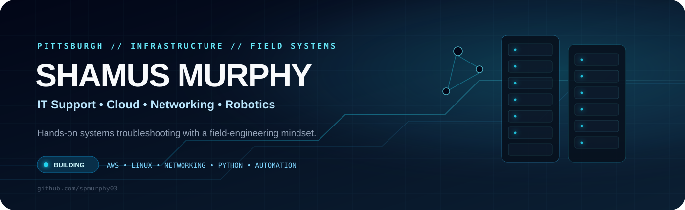
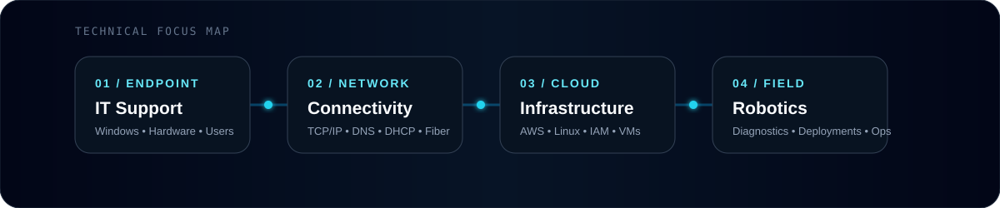

<p align="center">
  
</p>

<p align="center">
  
  
  
</p>

<p align="center">
  <a href="https://www.linkedin.com/in/shamus-p-murphy-40994a2a7"></a>
  <a href="https://github.com/spmurphy03"></a>
</p>

## `> operator_profile`

I’m an IT professional with hands-on experience across **help desk support, hardware/software troubleshooting, telecommunications, low-voltage systems, and robotics-support environments**.

My direction is infrastructure-heavy: **find the fault, understand the system, restore service, document what happened, and make the next failure easier to solve.** I’m currently pursuing an **A.S. in Computer Information Systems at CCAC** while expanding into AWS, Linux, networking, Python, and automation.

<p align="center">
  
</p>

## `> stack --active`

<p align="center">
  
  
  
  
  
  
</p>

<p align="center">
  
  
  
  
  
  
  
  
</p>

| DOMAIN | WHAT I WORK WITH |
|:--|:--|
| **Endpoint / Support** | Windows, hardware diagnostics, software issues, end-user support, ticket documentation |
| **Network / Telecom** | TCP/IP, DNS, DHCP, Ethernet, structured cabling, fiber fundamentals |
| **Cloud / Systems** | AWS fundamentals, Linux, IAM concepts, virtual machines, Git/GitHub |
| **Field / Robotics** | Hardware troubleshooting, connectivity checks, incident documentation, escalation workflows |

## `> build_queue`

| PROJECT | STATUS | PURPOSE |
|:--|:--:|:--|
| **AWS Static Website Lab** |  | Deploy, secure, document, and troubleshoot an S3-hosted static site |
| **Help Desk Troubleshooting Lab** |  | Turn realistic support incidents into documented diagnostic workflows |
| **Network Troubleshooting Toolkit** |  | Build command-driven TCP/IP, DNS, routing, and connectivity playbooks |
| **Robotics Support Knowledge Base** |  | Create a vendor-neutral field-support and escalation reference |

### What each project will prove

```text
OBSERVE  →  ISOLATE  →  TEST  →  FIX  →  VERIFY  →  DOCUMENT
```

I’m building projects around **evidence**, not buzzwords: screenshots, command output, diagrams, troubleshooting notes, configuration decisions, and lessons learned.

## `> experience`

### Aethon — Robotics Operations Specialist
Worked in a technical environment involving **autonomous mobile robotics**, supporting hardware, software, connectivity, and end-user issues while documenting and escalating technical problems.

### Alpha Scanlon LLC — Telecommunications & IT Technician
Hands-on field work involving **telecommunications, structured cabling, low-voltage systems, connectivity, hardware installation, and troubleshooting**.

## `> education && development`

**Community College of Allegheny County (CCAC)**  
A.S. Computer Information Systems — **Expected 2028**

**Current learning path**

```text
AWS  ─────────────► Cloud / Infrastructure
Linux ────────────► Systems
Networking ───────► Troubleshooting / Field Engineering
Python ───────────► Automation
Git + GitHub ─────► Documentation / Version Control
```

## `> target_roles`

**Robotics Field Service Engineer** • **Field Implementation Engineer** • **Cloud / Infrastructure Support** • **Systems / Network Technician** • **Automation / Reliability**

---

<p align="center">
  <b>Build it. Break it. Trace the failure. Fix it. Document it.</b>
</p>

<p align="center">
  <a href="https://www.linkedin.com/in/shamus-p-murphy-40994a2a7">LinkedIn</a>
  &nbsp;•&nbsp;
  <a href="https://github.com/spmurphy03">GitHub</a>
</p>
